# Progetto FCG - modellazione di un edificio
## 1. Modellazione della base dell'edificio
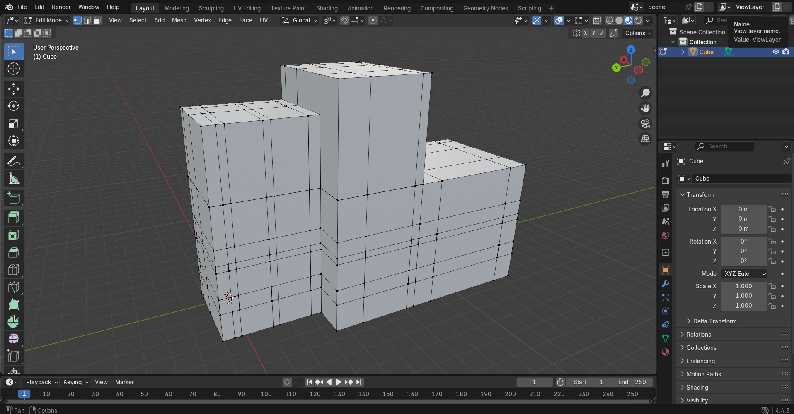
È stato modellato da un'unica mesh iniziale (un cubo) tramite lo strumento di *Grab* applicato alle facce richieste, estrusioni e divisioni di forme con lo strumento *LoopCut*.
## 2. Modellazione base del tetto
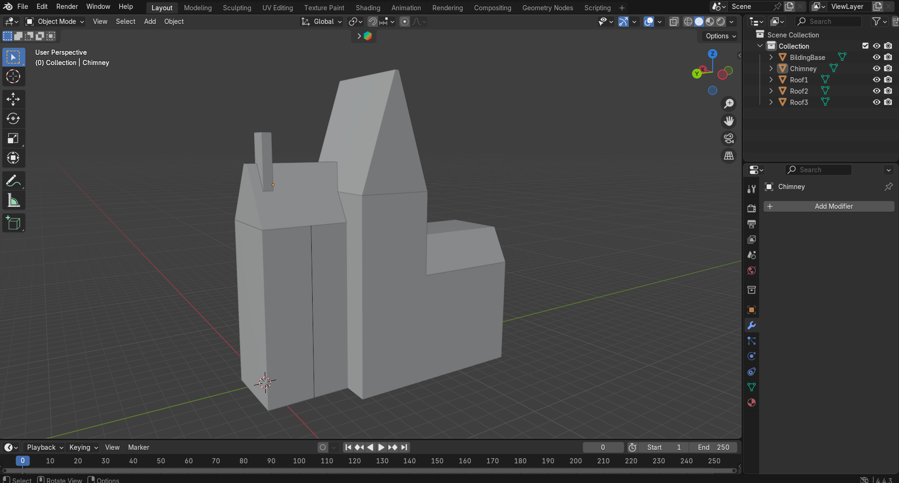
La seconda parte è composta da quattro mesh separate: tre per il tetto e una per il camino. Le due mesh più a destra sono state modellate in maniera similare alla base dell'edificio, per il primo tetto e il camino sono stati invece eseguiti dei passaggi in più, questo perchè hanno creato qualche prima difficoltà:
- Il tetto doveva essere intersecato con due forme, il secondo tetto e la base dell'edificio. Inizialmente ho applicato il modifier booleano, con l'intenzione di applicare una sottrazione di forme, ma essendo applicabile a due sole mesh, e non volendo unire il tetto all'edificio, ho optato per una divisione, seppur un poco più grezza, manuale. 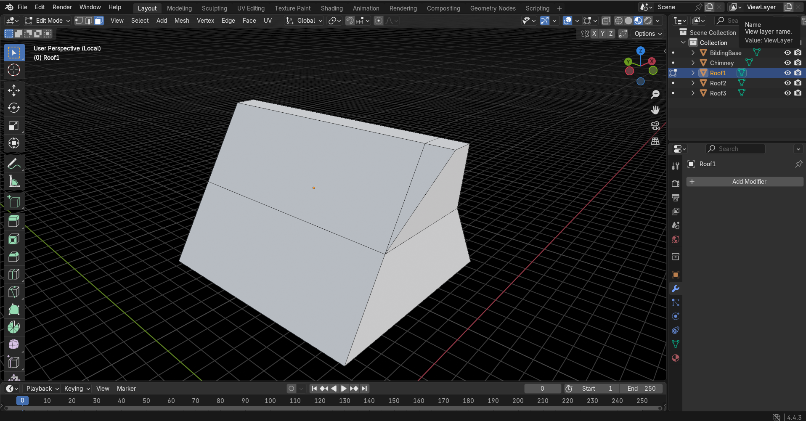
- Similmente il camino, che è stato ritagliato utilizzando il *LoopCut* e il *Join*, per poi elimiare le facce eccedenti, in modo da non creare una sovrapposizione di forme. 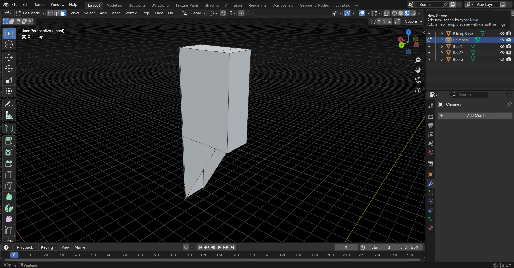
## 3. Dettagli dell'edificio
Essendo un poco piú corposa delle parti precedenti, la modellazione dei dettagli é stata suddivisa in piú parti, anche per semplicitá pratica. \
La mesh dell'edificio é stata divisa in due parti, in modo da avere il primo piano separato dal secondo; i primi dettagli sono quindi stati modellati separatamente, concentrandosi (comando "/") sulla parte desidetata.

**3.1 Dettagli piano terra** \
Riscontrati problemi con la divisione effettuata al punto [1], le suddivisioni sono state cancellate e rifatte, in modo da avere chiari gli spazi per estrudere porte e finestre. Con la sessa tecnica sono stati aggiunti i bordi dove necessario e la divisione tra i due piani in alto.
Vista con suddivisioni | Vista renderizzata
:-------------------------:|:-------------------------:
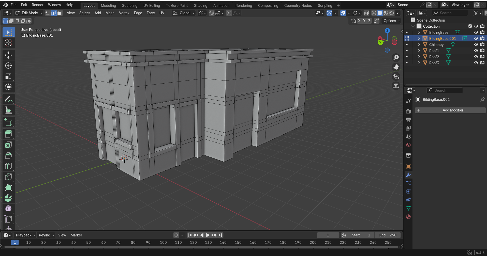 | 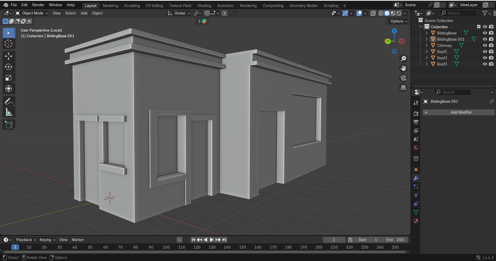

**3.2 Dettagli primo piano** \
Similmente al piano terra per gli spazi dove andranno inserite le finestre, é stata riscontrata qualche difficoltá in piú per le assi laterali. In un primo momento il comando *Bevel*, giá utilizzato per qualche asse verticale, era sembrata una buona soluzione, ma questo creava degli artefatti agi estremi dell'asse. Si é quindi proceduto con suddivisioni tramite *LoopCut* e collegamento di vertici.
Vista con suddivisioni | Vista renderizzata
:-------------------------:|:-------------------------:
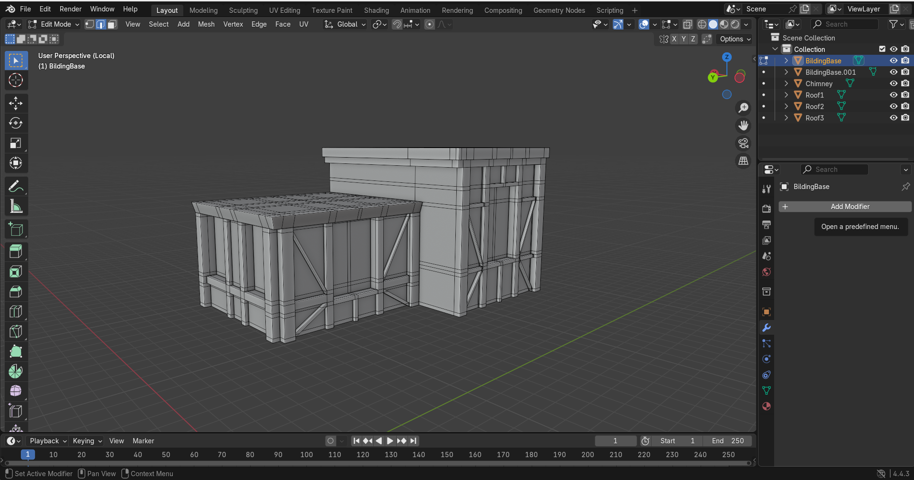 | 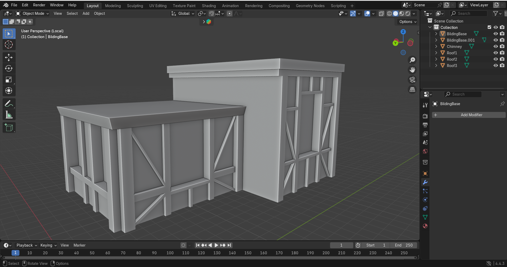

**3.3 Dettagli finali** \
Dopo l'aggiunta di qualche dimenticanza e la correzione di alcuni errori e artifatti l'edificio si presenta cosí:
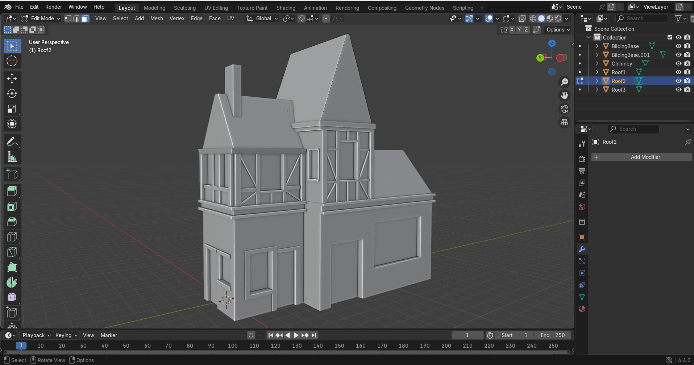

## 4. Dettagli del tetto
Come per la parte [3], il lavoro é stato suddiviso in sottosezioni. Le tre parti che compongono il tetto erano giá divise in 3 mesh, 4 se contiamo anche quella del camino.

**4.1 Primo tetto** \
Dopo essere stato allargato per somigliare di piú all'immagine di riferimento, sono stati estrusi i bordi. Il camino é stato poi modellato, aggiungendo qualche forma e i camini, posizionati come due ottagoni.
Vista con suddivisioni | Vista renderizzata
:-------------------------:|:-------------------------:
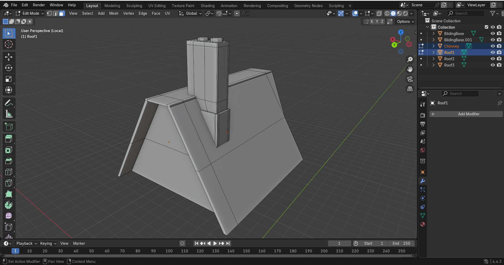 | 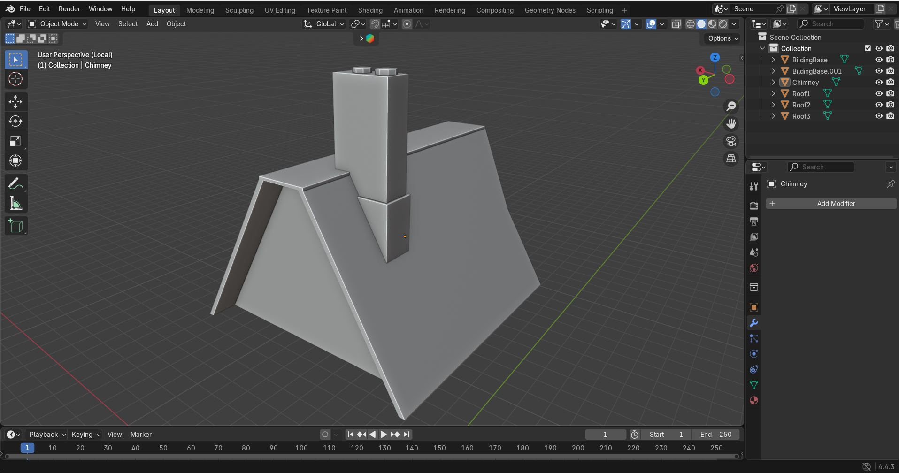

**4.2 Secondo tetto** \
Il secondo é stato piú complicato, dato il maggior numero di dettagli da aggiungere sulla parte frontale per comporre il terzo piano, ma con estrusioni, Bevel e qualche collegamento in piú sui vertici é stato contenuto un buon risultato.
Vista con suddivisioni | Vista renderizzata
:-------------------------:|:-------------------------:
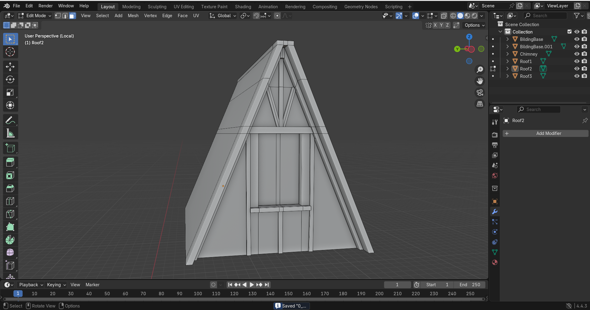 | 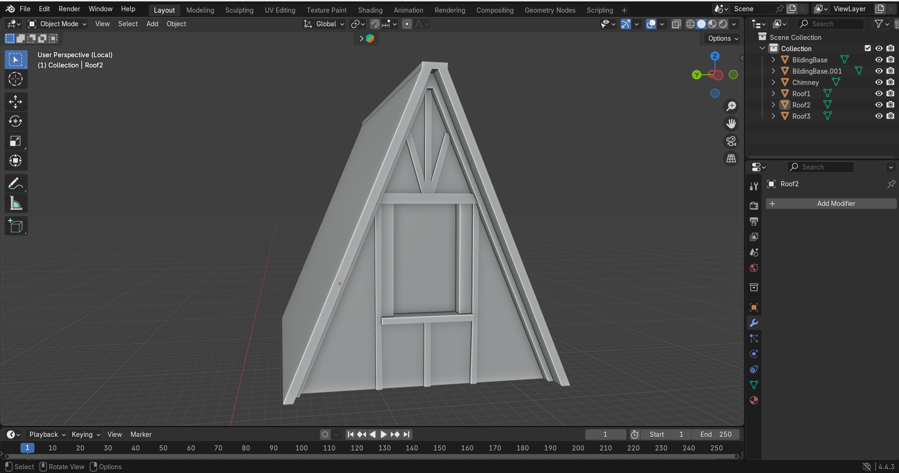