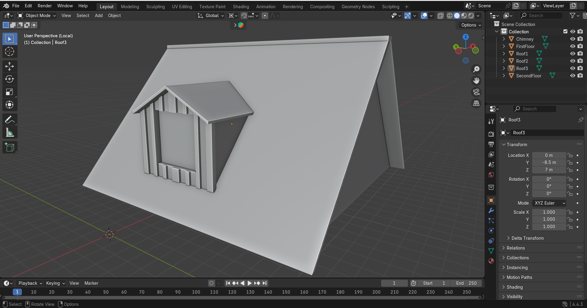
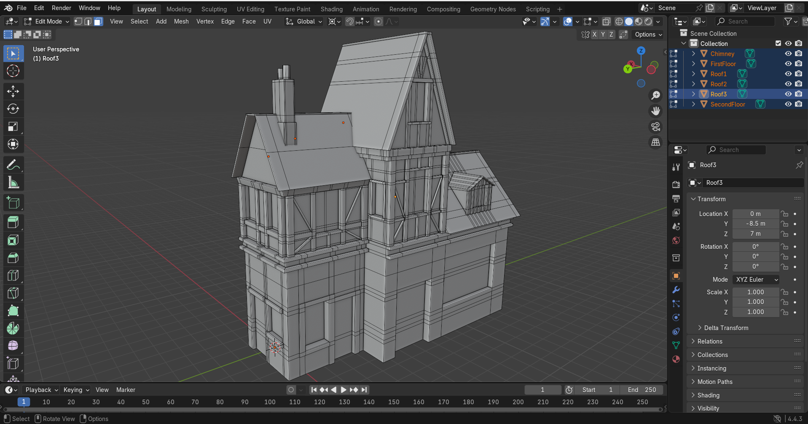
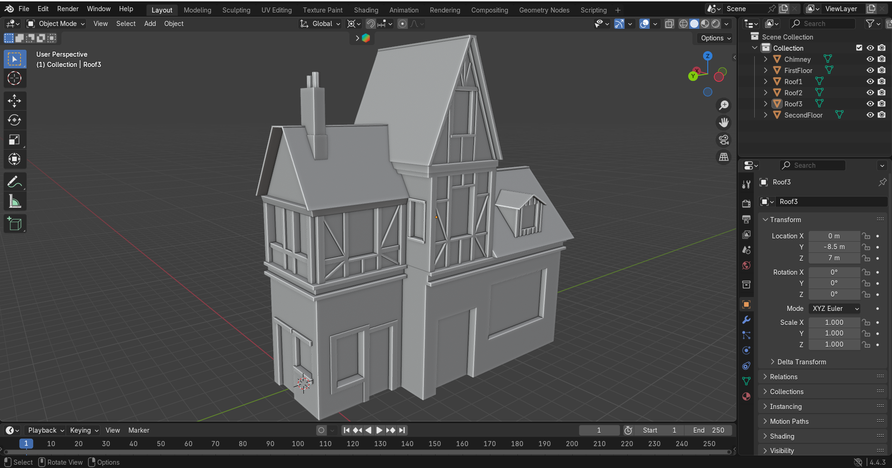

# Progetto FCG - modellazione di un edificio
## 1. Modellazione della base dell'edificio
La forma base dell'edificio é stata modellata partendo da un cubo. Dopo aver spostato la mesh sull'asse z di un metro, in modo che sia posizionato sullo zero rispetto a questo, ne sono state cambiate le dimensioni tramite lo strumento *Grab*. Le parti sporgenti sono invece state estruse. 

Per migliorare la precisione, e rendere la procedura piú semplice, ho attivato sotto il menu *Mesh edit mode overlays* l'opzione edge length, in modo da avere sotto controllo le misure della parte di mesh selezionata.

## 2. Modellazione base del tetto
La seconda parte è composta da quattro mesh separate: tre per il tetto e una per il camino. Per tutte e quattro le parti la figura di partenza é il cubo, che é stato inserito tramite il comando *shift A* e in seguito posizionato sopra la mesh giá modellata al punto [1].

Il secondo e terzo tetto, contando da sinistra, sono stati modellati allo steso modo della base dell'edificio, creando poi i lati inclinati spostando, sempre con lo strumento *Grab*, non tutta la faccia ma solamente lo spigolo desiderato. Il tetto rimanente ed il camino hanno invece richiesto un po' di lavoro in piú:
- Il tetto doveva essere intersecato con due forme, il secondo tetto e la base dell'edificio. Inizialmente ho applicato il modifier booleano, con l'intenzione di applicare una sottrazione di forme, ma essendo applicabile a due sole mesh, e non volendo unire il tetto all'edificio, ho optato per una divisione, seppur un poco più grezza, manuale. Questa é stata eseguita tramite *LoopCut* e la modifica delle forme tramite strumento *Grab* applicato agli spigoli. 
- Similmente il camino, che è stato ritagliato utilizzando il *LoopCut* e il *Join*, per poi elimiare le facce eccedenti, in modo da non creare una sovrapposizione di forme. 

Il risultato finale é quindi il seguente:

## 3. Dettagli dell'edificio
Data la maggiore quantitá di dettagli, e quindi *LoopCut*, da aggiungere, questa terza fase é stata suddivisa in piú sottosezioni. 

La mesh dell'edificio modellata al punto [1] é stata divisa in due parti, in modo da avere separati piano terra e primo piano. Per eseguire questa operazione é bastato selezionare le faccie di quello che sará il primo piano e separarle con il comando *p*. Utilizzando poi il focus (*/*) sono andata a lavorare sulle due sottosezioni separatamente. 

### 3.1 Dettagli piano terra
In questa prima parte era chiaro che i *LoopCut* inseriti al punto [1] sulla mesh non sarebbero andati bene, anche perché erano stati eseguiti per avere le suddivisioni di entrambi i piani, creando un piano di lavoro parecchio confusivo. Tramite la selezione multipla (tenendo premuto *shift*) e la selezione di *LoopCut* (*alt* piú right click del mouse nella modalitá selezione spigoli) sono stati quindi cancellati utilizzando il comando *ctrl x*.

Avendo ora una mesh pulita sono stati eseguiti dei nuovi *LoopCut*, questa volta concentrandosi solo su quelli necessari per il piano terra, e dove saranno posizionate porte e finestre é stata eseguita un'estrusione.

Per rendere i volumi meglio visibili anche in object mode la *cavity* nel menu *Viewport shading* é stata spuntata e selezionata su "entrambi". Gli ultimi dettagli aggiunti in questa fase ed estrusi sono le assi di legno sporgenti che separano i due piani.
Vista con suddivisioni | Vista renderizzata
:-------------------------:|:-------------------------:
 | 

### 3.2 Dettagli primo piano
Sono state eseguite pressoché le stesse operazioni iniziali della parte [3.1] per quanto riguarda i *LoopCut* e le estrusioni delle finestre. Ció che ha richiesto piú lavoro é stata la modellazione delle assi di legno, in particolar modo quelle posizionate in orizzontale. In un primo momento il comando *Bevel*, giá utilizzato per qualche asse verticale, era sembrata una buona soluzione, ma questo creava degli artefatti agi estremi dell'asse. Ho trovato un buon compromesso aggiungendo manualmente degli ulteriori *LoopCut* per ottenere dove necessario dei nuovi vertici, collegandoli poi in maniera appropriata tramite il comando *Join*. A questo punto eseguire le estrusioni ha completato il lavoro.
Vista con suddivisioni | Vista renderizzata
:-------------------------:|:-------------------------:
 | 

### 3.3 Dettagli finali
Dopo l'aggiunta di qualche dimenticanza e la correzione di alcuni errori e artifatti l'edificio si presenta cosí:

## 4. Dettagli del tetto
Come per la parte [3], il lavoro é stato suddiviso in sottosezioni. Le tre parti che compongono il tetto erano giá divise in 3 mesh, 4 se contiamo anche quella del camino.

### 4.1 Primo tetto
Dopo essere stato allargato per somigliare di piú all'immagine di riferimento, sono stati estrusi i bordi. Il camino é stato poi modellato, aggiungendo qualche forma e i camini, posizionati come due ottagoni.
Vista con suddivisioni | Vista renderizzata
:-------------------------:|:-------------------------:
 | 

### 4.2 Secondo tetto
Il secondo é stato piú complicato, dato il maggior numero di dettagli da aggiungere sulla parte frontale per comporre il terzo piano, ma con estrusioni, Bevel e qualche collegamento in piú sui vertici é stato contenuto un buon risultato.
Vista con suddivisioni | Vista renderizzata
:-------------------------:|:-------------------------:
 | 

### 4.3 Terzo tetto
Per il terzo tetto sono state effettuate le stesse operazioni dei due precedenti per quanto riguarda la resize, effettuata tramite selezione e spostamento degli edge, ed estrusione delle parti necessarie. 

Piú difficile é stata la creazione dell'abbaino: dopo aver creato i *LoopCut* necessari per delimitare lo spazio ho estruso le faccie che sarebbero diventate la parte verticale esterna dell'abbaino. Ponendo il cursore sulla parte selezionata e utilizzando il comando *Scale* sull'asse x in modo che arrivi a zero si crea la struttura base desiderata. 

Per realizzare il tetto dell'abbaino sono stati necessari alcuni tentativi, poiché estrudere le faccie, spostare con il comando *g* il lato superiore o procedere ancora una volta per *LoopCut* non ha funzionato. Alla fine ho trovato come soluzione estrudere i singoli vertici e modificarne un po' a misure un po' "a occhio" la posizione, per poi selezionarli a quattro a quattro e creare le faccie con il comando *f*.
Vista con suddivisioni | Vista renderizzata
:-------------------------:|:-------------------------:
 | 

### 4.4 Stato dell'edificio a fine quarta fase
Vista con suddivisioni | Vista renderizzata
:-------------------------:|:-------------------------:
 | 