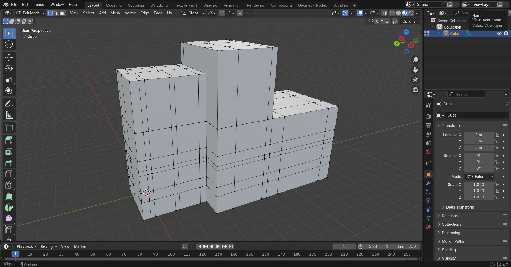
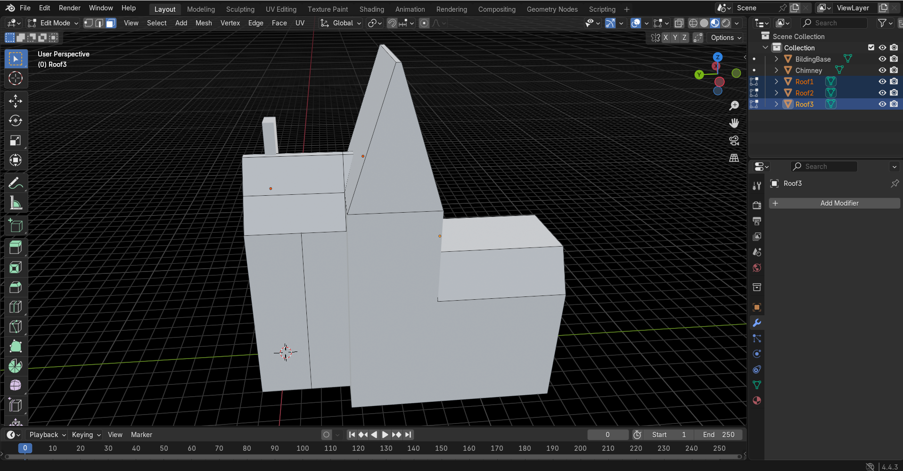
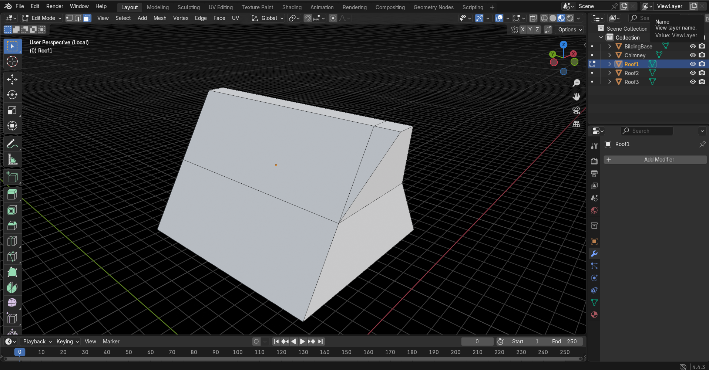
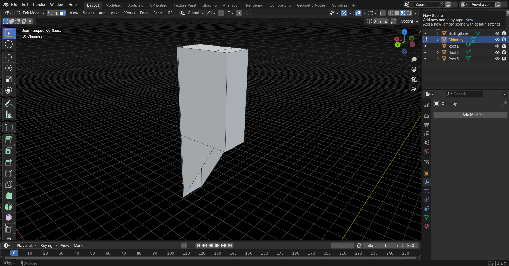

# Progetto FCG - modellazione di un edificio
## 1. Modellazione della base dell'edificio

È stato modellato da un'unica mesh iniziale (un cubo) tramite lo strumento di *Grab* applicato alle facce richieste, estrusioni e divisioni di forme con lo strumento *LoopCut*.
## 2. Modellazione base del tetto

La seconda parte è composta da quattro mesh separate: tre per il tetto e una per il camino. Le due mesh più a destra sono state modellate in maniera similare alla base dell'edificio, per il primo tetto e il camino sono stati invece eseguiti dei passaggi in più, questo perchè hanno creato qualche prima difficoltà:
- Il tetto doveva essere intersecato con due forme, il secondo tetto e la base dell'edificio. Inizialmente ho applicato il modifier booleano, con l'intenzione di applicare una sottrazione di forme, ma essendo applicamìbile a due sole mesh, e non volendo unire il tetto all'edificio, ho optato per una divisione, seppur un poco più grezza, manuale. 
- Similmente il camino, che è stato ritagliato utilizzando il *LoopCut* e il *Join*, per poi elimiare le facce eccedenti, in modo da non creare una sovrapposizione di forme. 
## 3. 